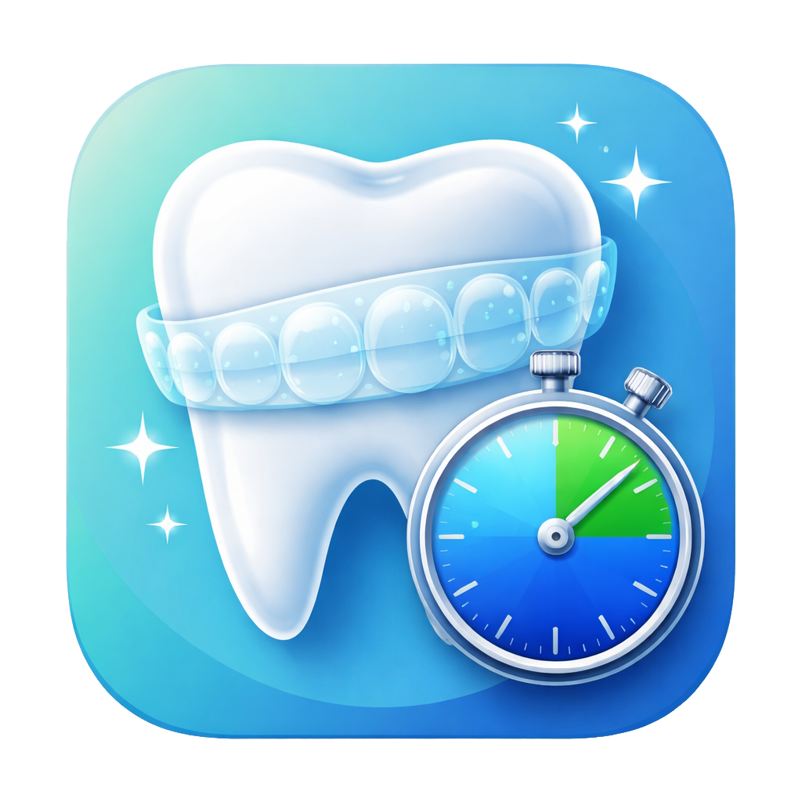

<p align="center">
  
</p>

<h1 align="center">Allineami for iOS</h1>

<p align="center">
  A timer for people wearing clear dental aligners.<br>
  Android version: <a href="https://github.com/mcrescentini/Allineami_Android">Allineami_Android</a>
</p>

---

Orthodontists usually ask you to wear clear aligners **22 hours a day**, which leaves **2 hours** for eating, brushing your teeth and cleaning the aligners. Allineami keeps track of that time: tap a button when you take them out, tap it again when you put them back in, and always see how much time you have left.

The app's interface is in Italian.

## Features

- **One-tap timer**: "Togli Allineatore" (take out) starts the count, "Monta Allineatore" (put back) stops it
- **Budget ring**: green, orange or red depending on how much time you have left, with an *OVER* label when you go past it
- **Daily summary**: hours worn, hours out, current session and daily budget
- **Weekly statistics**: a chart of hours worn against your goal, plus a list of days you can edit or delete
- **CSV export** of your sessions over a date range, to share with your orthodontist
- **Custom goal** from 10 to 23 hours a day
- **Live Activity and Dynamic Island**: the timer stays visible on the lock screen
- **Reminders** every 15 minutes while the aligners are out
- **Automatic day change**: if the timer is still running after midnight, the time is split across the right days

## Privacy

Allineami **collects no data**: no account, no internet connection, no ads or tracking. Everything stays on your device. Read the [privacy policy](PRIVACY.md) (English and Italian).

## Project structure

```
.
├── Allineami/                 App (SwiftUI + SwiftData)
│   ├── TodayView.swift        Timer, budget ring, notifications, Live Activity
│   ├── StatsView.swift        Weekly chart and day editing
│   ├── ExportView.swift       CSV export
│   ├── SettingsView.swift     Daily goal and credits
│   └── …                      SwiftData models, dates, formatting
├── AllineamiWidget/           Live Activity and Dynamic Island (WidgetKit)
├── Allineami.xcodeproj
└── PRIVACY.md
```

## Building

Requirements: a Mac with **Xcode 26** or later. The app runs on **iOS 18.6** and later.

1. Open `Allineami.xcodeproj` in Xcode
2. Under *Signing & Capabilities*, select your development team for both targets (`Allineami` and `AllineamiWidgetExtension`). If you use a different account, also change the bundle identifiers (`com.allineami.app` and `com.allineami.app.widget`)
3. Press **Run**

## Tech stack

- **Swift** and **SwiftUI**
- **SwiftData** to store sessions on the device
- **Swift Charts** for the weekly chart
- **ActivityKit / WidgetKit** for the Live Activity and Dynamic Island
- **UserNotifications** for reminders

## License

Allineami is free software, released under the **GNU GPL v3** ([LICENSE](LICENSE)) with the **additional terms** allowed by Section 7, described in [NOTICE](NOTICE). In short:

- you may use, study and modify the code;
- if you distribute a modified version, you must publish its **source code under the same license**;
- you must keep the credit **"Based on Allineami by RootLabs — https://rootlabs.it/ — crescentinistudio.it"** and show it in the app's settings;
- published versions must use a **different name and icon** from "Allineami".

## Credits

Made by **[RootLabs](https://rootlabs.it/)** · [crescentinistudio.it](https://crescentinistudio.it/)

## Disclaimer

Allineami is a reminder tool and **is not a medical device**. Always follow your orthodontist's instructions for your treatment.
